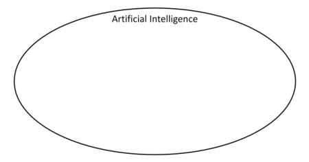
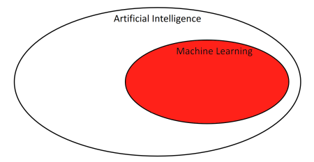
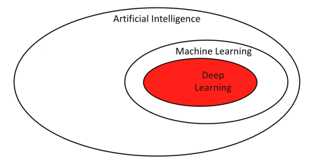
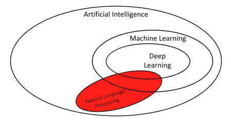
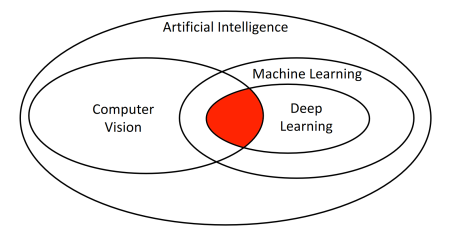
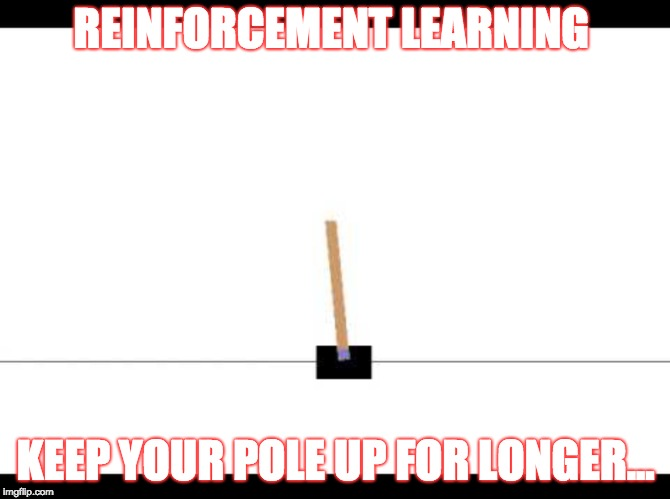
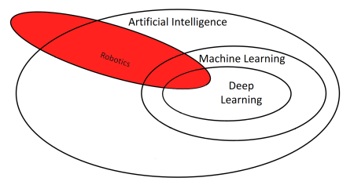

# Awesome Full Stack Machine Learning Engineering Courses
This is curated list of publicly accessible machine learning coureses from top universities such as Berkeley, Harvard, Stanford, and MIT. It also includes machine learning project case studies from large and experienced companies. THe list is broken down by topics and areas of specializations. Python is the preferred language of choice as it covers end-to-end machine learning engineering.

Special thanks to the schools to make their course videos and assignments publicly available.

## Computer Science

Foundational computer science, Python, and SQL skills for machine learning engineering.

### :books: Textbooks
[Grokking Algorithms](https://github.com/KevinOfNeu/ebooks/blob/master/Grokking%20Algorithms.pdf)

[Google Python Style Guide](https://github.com/google/styleguide/blob/gh-pages/pyguide.md)

[Python Design Patterns](https://github.com/faif/python-patterns)

[Python3 Patterns](https://python-3-patterns-idioms-test.readthedocs.io/en/latest/)

[Design Patterns: Elements of Reusable Object-Oriented Software 1st Edition](https://www.amazon.com/Design-Patterns-Elements-Reusable-Object-Oriented-dp-0201633612/dp/0201633612)

### :school: Courses
[MIT: The Missing Sememster of Your CS Education](https://missing.csail.mit.edu/) :star:

[edX MITX: Introduction to Computer Science and Programming Using Python](https://www.edx.org/course/6-00-1x-introduction-to-computer-science-and-programming-using-python-4) :star:

[edX Harvard: CS50x: Introduction to Computer Science](https://www.edx.org/course/cs50s-introduction-to-computer-science) 

[SQL for Data Analysis](https://classroom.udacity.com/courses/ud198)

[Corey Schafer Python Tutorials](https://www.youtube.com/watch?v=YYXdXT2l-Gg&list=PL-osiE80TeTt2d9bfVyTiXJA-UTHn6WwU)

[PostgreSQL Exercises](https://pgexercises.com/)

## Math and Statistics
Linear algebra and statistics


#### :school: Courses
[MIT 18.05: Introduction to Probability and Statistics](https://ocw.mit.edu/courses/mathematics/18-05-introduction-to-probability-and-statistics-spring-2014/) :star:

[MIT 18.06: Linear Algebra](https://ocw.mit.edu/courses/mathematics/18-06-linear-algebra-spring-2010/) :star:

[Stanford Stats216: Statiscal Learning](https://lagunita.stanford.edu/courses/HumanitiesSciences/StatLearning/Winter2016/about) :star:

[CalTech: Learning From Data](https://work.caltech.edu/telecourse.html)

[Introduction to Linear Algebra for Applied Machine Learning with Python](https://pabloinsente.github.io/intro-linear-algebra)


## Artificial Intelligence

Artificial Intelligence is the superset of Machine Learning. These courses provides a much higher level understanding of the field of AI, including searching, planning, logic, constrain optimization, and machine learning.



#### :books: Textbooks

[Artificial Intelligence: A Modern Approach](https://www.amazon.com/Artificial-Intelligence-Modern-Approach-3rd/dp/0136042597)

#### :school: Courses

[Berkeley CS188: Artificial Intelligence](https://edge.edx.org/courses/course-v1:BerkeleyX+CS188+2018_SP/course/) :star:

[edX ColumbiaX: Artificial Intelligence](https://www.edx.org/course/artificial-intelligence-ai): [[Reference Solutions](https://github.com/leehanchung/CSMM-101x-AI)]


## Machine Learning

Machine learning.



#### :books: Textbooks
[Mathematics for Machine Learning](https://mml-book.github.io/)

[Concise Machine Learning](https://people.eecs.berkeley.edu/~jrs/papers/machlearn.pdf)

[The Elements of Statistical Learning](https://web.stanford.edu/~hastie/Papers/ESLII.pdf)

[Mining of Massive Datasets](http://www.mmds.org/)

[Pattern Recognition and Machine Learning](https://www.microsoft.com/en-us/research/uploads/prod/2006/01/Bishop-Pattern-Recognition-and-Machine-Learning-2006.pdf): [[Codes](https://github.com/ctgk/PRML)]

[Cross-Industry Process for Data Mining methodology](ftp://public.dhe.ibm.com/software/analytics/spss/documentation/modeler/18.0/en/ModelerCRISPDM.pdf)

#### :school: Courses

[Columbia COMS W4995: Applied Machine Learning](https://www.cs.columbia.edu/~amueller/comsw4995s20/schedule/) [:tv:](https://www.youtube.com/playlist?list=PL_pVmAaAnxIRnSw6wiCpSvshFyCREZmlM)

[Stanford CS229: Machine Learning](https://see.stanford.edu/Course/CS229) [:tv:](https://www.youtube.com/playlist?list=PLoROMvodv4rMiGQp3WXShtMGgzqpfVfbU)

[edX ColumbiaX: Machine Learning](https://www.edx.org/course/machine-learning)

[Berkeley CS294: Fairness in Machine Learning](https://fairmlclass.github.io/)

[Google: Machine Learning Crash Course](https://developers.google.com/machine-learning/crash-course)

[Google: AI Education](https://ai.google/education/)

[Cornell Tech CS5785: Applied Machine Learning](https://cornelltech.github.io/cs5785-fall-2019/) [:tv:](https://www.youtube.com/playlist?list=PL2UML_KCiC0UlY7iCQDSiGDMovaupqc83)

[Probabilistic Machine Learning (Summer 2020)](https://uni-tuebingen.de/de/180804) [:tv:](https://www.youtube.com/playlist?list=PL05umP7R6ij1tHaOFY96m5uX3J21a6yNd)

[AutoML - Automated Machine Learning](https://ki-campus.org/courses/automl-luh2021)

## Machine Learning Engineering

These courses helps you bridge the gap from training machine learning models to deploy AI systems in the real world.


#### :books: Textbooks
[Machine Learning Engineering](http://www.mlebook.com/wiki/doku.php)

[Feature Engineering and Selection: A Practical Approach for Predictive Models](http://www.feat.engineering/a-simple-example.html)

[Continuous Delivery for Machine Learning](https://martinfowler.com/articles/cd4ml.html)

#### :school: Courses
[Berkeley: Full Stack Deep Learning](https://fullstackdeeplearning.com/) :star:

[Andrew Ng: Bridging AI's Proof-of-Concept to Production Gap](https://www.youtube.com/watch?v=tsPuVAMaADY)

[Facebook Field Guide to Machine Learning](https://research.fb.com/blog/2018/05/the-facebook-field-guide-to-machine-learning-video-series/)

[Udemy: Deployment of Machine Learning Models](https://www.udemy.com/course/deployment-of-machine-learning-models) :star:

[Pipeline.ai: Hands-on with KubeFlow + Keras/TensorFlow 2.0 + TF Extended (TFX) + Kubernetes + PyTorch + XGBoost](https://www.youtube.com/watch?v=AaBqhGEwxXI)

[Spark](https://classroom.udacity.com/courses/ud2002)

[Udemy: The Complete Hands On Course To Master Apache Airflow](https://www.udemy.com/course/the-complete-hands-on-course-to-master-apache-airflow)


## Deep Learning Overview

Basic overview for deep learning.



#### :books: Textbooks
[Deep Learning](http://www.deeplearningbook.org/)

[Dive into Deep Learning](http://d2l.ai/index.html)

[The Matrix Calculus You Need For Deep Learning](https://arxiv.org/pdf/1802.01528.pdf)

#### :school: Courses
[Berkeley CS 182: Designing, Visualizing and Understanding Deep Neural Networks](https://cs182sp21.github.io/)

[Deeplearning.ai Deep Learning Specialization](https://www.coursera.org/specializations/deep-learning): [[Reference Solutions](https://github.com/leehanchung/deeplearning.ai)] :star:

[NYU: Deep Learning](https://atcold.github.io/pytorch-Deep-Learning/)

[Fast.ai Part 2](https://course.fast.ai/part2)


## Specializations

### Recommendation Systems

Recommendation system is used when users do not know what they want and cannot use keywords to describe needs.


#### :books: Textbooks
[Mining of Massive Datasets](http://www.mmds.org/)

[Speech and Language Processing](https://web.stanford.edu/~jurafsky/slp3/)

[Dive into Deep Learning: Chapter 16 Recommender Systems](http://d2l.ai/chapter_recommender-systems/index.html)

#### :school: Courses

[Stanford CS246: Mining Massive Data Sets](http://web.stanford.edu/class/cs246/)

### Information Retrieval and Web Search

Search and Ranking is used when users have specific needs and can use keywords to describe their needs.

#### :books: Textbooks
[Introduction to Information Retrieval](https://nlp.stanford.edu/IR-book/)

#### :school: Courses
[Stanford CS276: Information Retrieval and Web Search](http://web.stanford.edu/class/cs276/)


### Natural Language Processing

With languages models and sequential models, everyone can write like GPT-3.



#### :books: Textbook
[Deep Learning](http://www.deeplearningbook.org/)

[Introduction to Natural Language Processing](https://www.amazon.com/Introduction-Language-Processing-Adaptive-Computation/dp/0262042843)

[Speech and Language Processing](https://web.stanford.edu/~jurafsky/slp3/)

#### :school: Courses
[Stanford CS224n: Natural Language Processing with Deep Learning](http://web.stanford.edu/class/cs224n/): [[Reference Solutions](https://github.com/leehanchung/cs224n)] :star:

[Berkeley CS182: Designing, Visualizing, and Understanding Deep Neural Networks](https://cs182sp21.github.io/): [:tv:](https://www.youtube.com/watch?v=rSY1pVGdZ4I&list=PL_iWQOsE6TfVmKkQHucjPAoRtIJYt8a5A) [[Reference Solutions](https://github.com/leehanchung/cs182)]

[Deeplearning.ai Natural Language Processing Specialization](https://www.deeplearning.ai/natural-language-processing-specialization/) [[Reference Solutions](https://github.com/leehanchung/deeplearning.ai-nlp-specialization)]


### Vision

Neural nets cannot solve all vision problems, yet.



#### :books: Textbooks
[Deep Learning](http://www.deeplearningbook.org/)

#### :school: Courses
[Stanford CS231n: Convolutional Neural Networks for Visual Recognition](http://cs231n.stanford.edu/): [[Assignment 2 Solution](https://github.com/leehanchung/cs182/tree/master/assignment1), [Assignment 3 Solution](https://github.com/leehanchung/cs182/tree/master/assignment2)] :star:

[Berkeley CS182: Designing, Visualizing, and Understanding Deep Neural Networks](https://cs182sp21.github.io/): [:tv:](https://www.youtube.com/watch?v=rSY1pVGdZ4I&list=PL_iWQOsE6TfVmKkQHucjPAoRtIJYt8a5A) [[[Reference Solutions](https://github.com/leehanchung/cs182)]


### Unsupervised Learning and Generative Models


#### :school: Courses
[Stanford CS236: Deep Generative Models](https://deepgenerativemodels.github.io/)

[Berkeley CS294-158: Deep Unsupervised Learning](https://sites.google.com/view/berkeley-cs294-158-sp19/home)


### Reinforcement Learning



#### :books: Textbook

[Reinforcement Learning](http://www.incompleteideas.net/book/the-book.html)

[Deep Learning](http://www.deeplearningbook.org/)

#### :school: Courses
[Coursera: Reinforcement Learning Specialization](https://www.coursera.org/specializations/reinforcement-learning) <= Recommended by [Richard Sutton](https://www.reddit.com/r/MachineLearning/comments/h940xb/what_is_the_best_way_to_learn_about_reinforcement/), the author of the de facto textbook on RL. :star:

[Berkeley CS182: Designing, Visualizing, and Understanding Deep Neural Networks](https://cs182sp21.github.io/): [:tv:](https://www.youtube.com/watch?v=rSY1pVGdZ4I&list=PL_iWQOsE6TfVmKkQHucjPAoRtIJYt8a5A)  [[Reference Solutions](https://github.com/leehanchung/cs182)]

[Stanford CS234: Reinforcement Learning](https://web.stanford.edu/class/cs234/)

[Berkeley CS285: Deep Reinforcement Learning](http://rail.eecs.berkeley.edu/deeprlcourse/) :star:

[CS 330: Deep Multi-Task and Meta Learning](http://cs330.stanford.edu/): [Videos](https://www.youtube.com/playlist?list=PLoROMvodv4rMC6zfYmnD7UG3LVvwaITY5)

[Berekley: Deep Reinforcement Learning Bootcamp](https://sites.google.com/view/deep-rl-bootcamp/lectures)

[OpenAI Spinning Up](https://spinningup.openai.com/en/latest/)

IDS at Stanford RL forum [Video 1](https://stanford.zoom.us/rec/share/3Xd-OxnFkFfXV3UBRGo68iScSbckWF-3OKuVQkEQc_igSL9JRyuwDvgXDArMHtFz.6s3GFT1XBvZf7eis?startTime=1610388191000) [Video 2](https://stanford.zoom.us/rec/share/8Ex0ug8ueM0G3DLAW4XLYTlhgV812fOkL5aUYjxes6JFysWglqa-FCNryj-GUn2a.21yA0Q1WPwhwZMgF?startTime=1610560965000) [Slides](https://drive.google.com/file/d/1KSFVptieJ-b115mLqAYfp2pVhJZ02qWh/view?usp=sharing)

### Robotics :robot:

Quaternions, quaternions everywhere. And gradients.



#### :school: Courses
[ColumbiaX: CSMM.103x Robotics](https://courses.edx.org/courses/course-v1:ColumbiaX+CSMM.103x+1T2020/)

[CS 287: Advanced Robotics](https://people.eecs.berkeley.edu/~pabbeel/cs287-fa19/)


# LICENSE
All books, blogs, and courses are owned by their respective authors.

You can use my compilation and my reference solutions under the open CC BY-SA 3.0 license and cite it as:
```
@misc{leehanchung,
  author = {Lee, Hanchung},
  title = {Full Stack Machine Learning Engineering Courses},
  year = {2020},
  howpublished = {Github Repo},
  url = {https://github.com/full_stack_machine_learning_engineering_courses}
}
```
